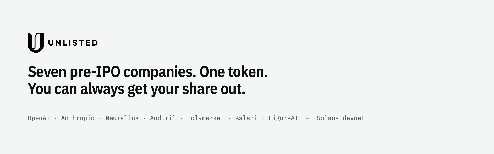

<p align="center">
  <picture>
    <source media="(prefers-color-scheme: dark)" srcset="brand/png/unlisted-banner-dark.png">
    
  </picture>
</p>

# Unlisted

**A basket of tokenized pre-IPO companies that still pays you out when the issuer acts.**

PreStocks, the tokens Unlisted holds, are controlled by a 2-of-7 multisig with no time lock. It can pause them, seize them from any account, and change what it costs to move them. It has seized and it has re-priced; a pause hasn't been seen on mainnet, but nothing stops one:

- **Seized:** it emptied 29 holders' accounts to zero on 2025-09-19, with no memo.
- **Changed the fee three times in sixteen days:** 0 → 50 → 100 → 300 bps. The last two came with no announcement we could find, and PreStocks has since confirmed there is no channel announcing such changes in advance. Unlisted reads the mints directly instead.

Basket protocols break when that happens. Symmetry, run with its own program on a mainnet fork, burns the user's shares and then pays nothing while one leg is paused, and fails every redemption after a seizure. It does handle transfer fees correctly; fees aren't the problem.

Unlisted is built so that:
- a paused name becomes a claim while the other legs pay out;
- a seizure is detected and shared pro rata;
- no oracle is involved.

**What it costs, plainly.** Minting or redeeming Unlisted is never cheaper than buying the seven tokens directly. Every leg pays the issuer's transfer fee in and out, which at 300 bps is about 5.9% for a round trip before spread. The convenience of one transferable token and one account is a secondary benefit.

**Disclosed.** OpenAI and Anthropic say share transfers to SPVs are void. Both stay in the basket at equal weight, and the exposure is stated in the app ([risks](docs/risks.md#3-the-spv-dispute-openai-and-anthropic-say-the-underlying-transfers-are-void)). PreStocks has not endorsed this project. We have asked them in writing; their Terms appear to permit wrapping and pooling without their consent ([risks §2](docs/risks.md#issuer-stance-decided)).

**Repository:** [github.com/Unlisted-Org/unlisted](https://github.com/Unlisted-Org/unlisted). The on-chain program keeps `basket` as its technical name (crate, accounts, PDA seeds, instructions).

## Status

- **Devnet only, by design.** The failure cases are issuer actions, which only the issuer's keys can trigger on mainnet. Fixture mints mirror PreStocks extension for extension, so every issuer action can be run against the program, with signatures.
- **Specs approved** (`docs/specs/`). The share maths is an executable model with 17 property tests (`spec/model/`).
- **Deployed on devnet:**
  - the program, `GyiHodshTGFo7hXSXGQiHLTCzH9yF2QWWHy6s7sm6QQv`, with the canonical basket over seven fixture mints;
  - the app, at [unlisted-basket.vercel.app/app](https://unlisted-basket.vercel.app/app);
  - the valuation API and issuer watcher, on Railway;
  - every cited signature, on [/evidence](https://unlisted-basket.vercel.app/evidence).
- **The live app runs the whole story:** buy in, the fixture issuer pauses one company, redeem anyway (six pay now, one becomes a claim), the pause lifts, the claim pays out. A fresh-wallet browser test runs it against the live site; the records are in `web/e2e/holder/runs/`.
- This README is updated only when something is proven.

## Read

| What | Where |
|---|---|
| The pitch and the evidence behind each claim | [docs/pitch.md](docs/pitch.md) |
| Evidence: Symmetry fork runs, devnet issuer actions, mainnet seizure record | [evidence/](evidence/README.md) |
| The issuer, the fee history, the SPV dispute | [docs/risks.md](docs/risks.md) |
| Specs: agent split, share maths, on-chain interface, valuation API | [docs/specs/](docs/specs/) |
| Investigation reports | [docs/phase0.md](docs/phase0.md), [docs/phase0-fee-escrow.md](docs/phase0-fee-escrow.md) |

## Reproduce

```sh
python3 -m unittest discover -s spec/model -v   # share-maths model: 17 property tests
cd evidence/symmetry-fork
./run.sh                                         # Symmetry on three fresh mainnet forks (needs surfpool)
node mainnet-recon.js                            # live mainnet record-vs-balance read
```
