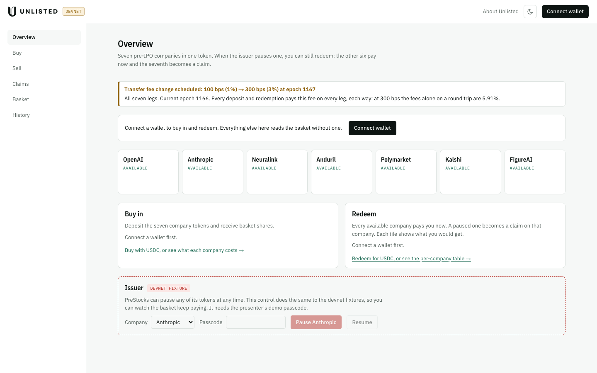
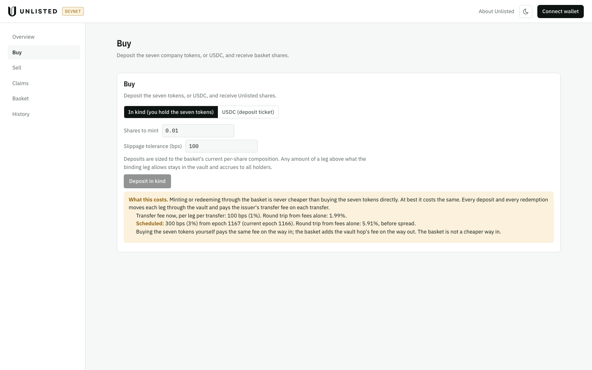
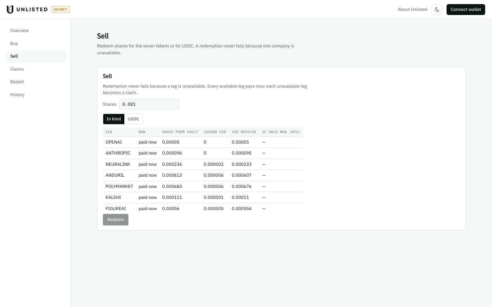
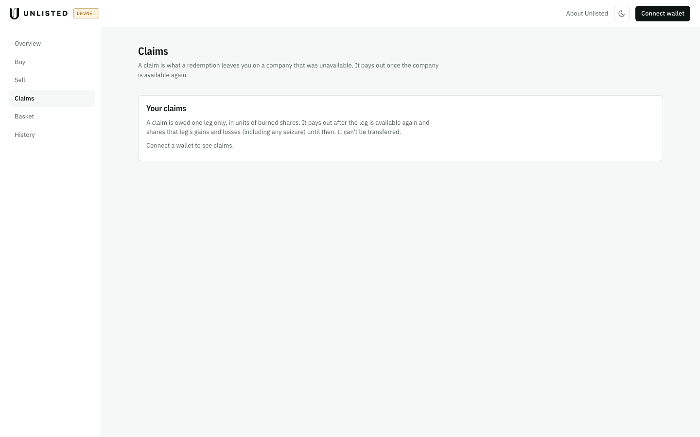
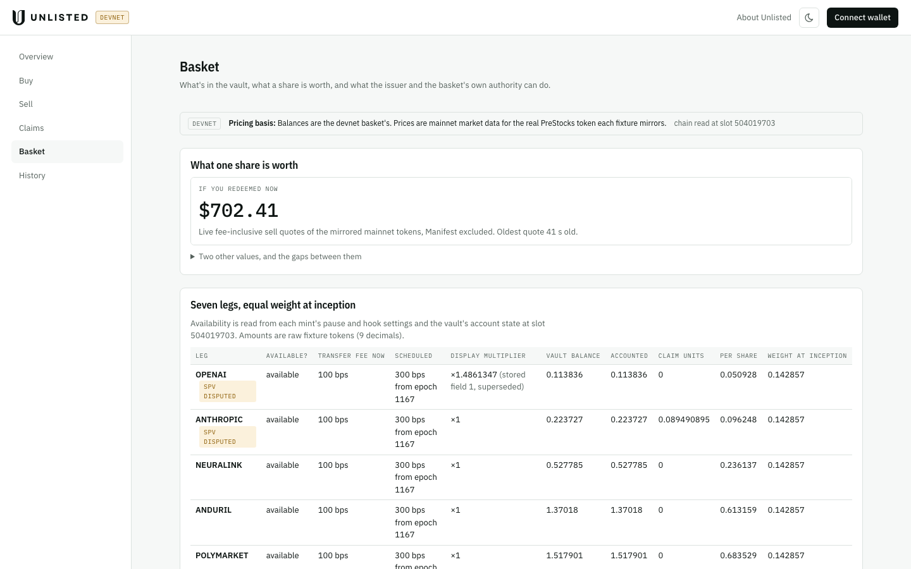
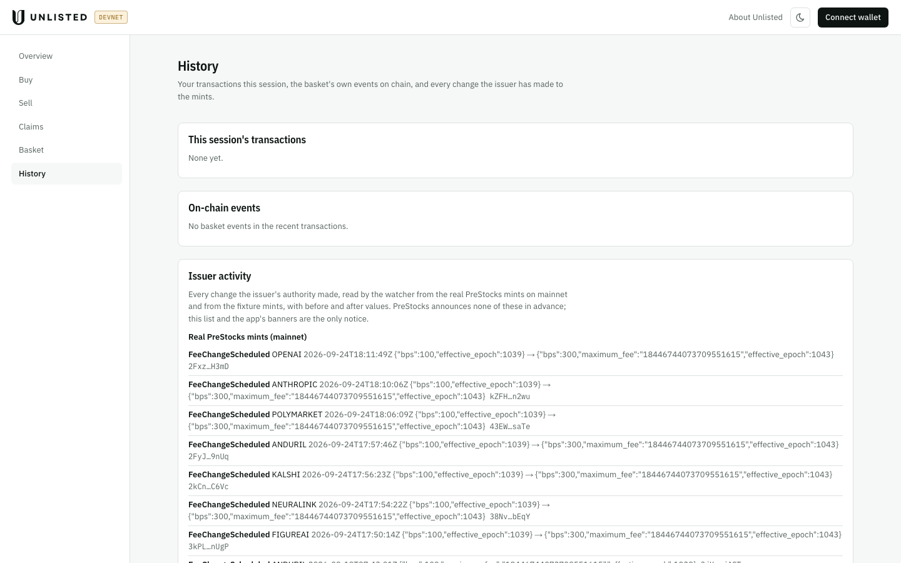

The app is at **[unlisted-rosy.vercel.app/app](https://unlisted-rosy.vercel.app/app)**, on devnet only. This guide describes the deployed app as read on 2026-09-25, and its code on `main` at `92fe09c`. Connecting a wallet is on its own page: [Wallet connection](/app/wallet/).

## The frame

- **Header:** the Unlisted mark and a **DEVNET** badge; *About Unlisted* (back to the landing page); a light/dark toggle; and the **Connect wallet** button, which shows your address once connected.
- **Sidebar:** six routes, one per item: **Overview**, **Buy**, **Sell**, **Claims**, **Basket** and **History**. When you have open claims, the Claims item carries their count. On a phone the sidebar becomes a row of tabs under the header.
- **Without a wallet** every route still reads the basket. The places that need a wallet say *Connect a wallet first*.

The app re-reads the chain on a timer (every 15 seconds on the hosted app) and after every action you take.

## Overview

The Overview is the whole story on one screen: buy in, the issuer pauses one company, redeem anyway, the pause lifts, the claim pays out. From top to bottom:

### Issuer banners

A banner appears for every issuer action in effect, read straight from the mints:

- **A pause:** "ANTHROPIC is paused by the issuer", explaining that deposits are refused and redemptions still pay the other six legs now.
- **A transfer hook** set on a company, or **the basket's vault frozen** for one.
- **A scheduled fee change.** On 2026-09-25 every route showed: "Transfer fee change scheduled: 100 bps (1%) → 300 bps (3%) at epoch 1167", with the current epoch and the round-trip cost at the new rate (5.91% from fees alone).
- **A scheduled display-multiplier change**, before it takes effect.
- **A shortfall recorded on chain** (a seizure): how much the vault dropped, and that every holder, open claim and open deposit on that company bears the same fraction.
- **New deposits stopped** by the basket's authority, if that ever happens.

There is no advance notice from PreStocks for any of these; the banners are the notice ([The problem](/product/problem/#no-advance-warning-exists)).

### Your position

One line. Without a wallet it says *Connect a wallet to buy in and redeem. Everything else here reads the basket without one.* Connected, it shows your shares, what they're worth if you redeemed now (from the valuation service), and a link to your open claims if you have any.

### The seven company tiles

One tile per company, with its state as a word: **available**, **Paused by the issuer**, **Transfer hook set** or **Vault frozen**. With a wallet connected, a tile also shows:

- **If you hold shares:** *If you redeem:* the amount of that company you'd receive now, net of the issuer's fee, or *becomes a claim* if it's unavailable.
- **If you have an open claim on it** (this takes precedence): *Your claim:* its units; once the company is available, *Pays* amount *now* and a **Settle** button. While it's still unavailable the button reads *Pays when resumed* and is disabled.
- **If you have no shares yet:** *In your wallet:* your balance of that company.

The tiles sit seven across on a wide screen and one per row on a phone.

### Buy in

Deposits the seven company tokens in kind and mints shares.

- **The size is filled in for you:** 90% of the most your wallet's balances can buy, leaving room for the basket to move before the transaction lands. You can type another amount.
- **Before you sign** it says how many shares it mints: *Mints X shares. One wallet approval.*
- If your wallet doesn't hold enough of every company for the size you typed, it says so and the button stays disabled.
- **While any company is unavailable** it says *Deposits are refused while Anthropic is unavailable. Redeeming still works.* and won't buy.
- **If your wallet holds none of the seven,** it offers **Get test tokens** instead ([Wallet connection](/app/wallet/#devnet-sol-and-test-tokens)).
- A link goes to **Buy** for USDC deposits and the per-company table.

### Redeem

Redeems shares in kind.

- **The amount starts at all your shares**; type less, or click *All* to go back to all of them.
- **Before you sign** it summarises the outcome, for example *6 pay now, 1 becomes a claim.* The tiles above show each company's amount.
- A link goes to **Sell** for USDC redemptions and the per-company table.

### Your last transaction

The most recent action: its name, whether it succeeded, how many transactions it took and how many wallet approvals, and each signature. The full list for the session is on History.

### The issuer control

A dashed box marked **Issuer · devnet fixture**. PreStocks can pause any of its tokens at any time; this control does the same to the devnet fixture mints, so you can watch the basket keep paying.

- Pick a company, enter the passcode, and press **Pause** *company* or **Resume**.
- **It needs the presenter's demo passcode.** The app's server checks it and then signs the pause or resume as the devnet fixture issuer. Your wallet isn't asked for anything.
- The app then sees the pause exactly as it would see a real one: by reading the mint.

## The story on the Overview, recorded

The app's own test ran the whole story on the deployed site with a wallet created for each run. The screenshots below are from the run of 13:29 UTC on 2026-09-25 (`web/e2e/holder/runs/2026-09-25-devnet-overview.json`); the signatures are on [The user flow](/product/user-flow/).

After buying in and with ANTHROPIC paused by the issuer control, the tiles say what redeeming would do, and Buy in refuses:

After redeeming, ANTHROPIC's tile holds the claim, the sidebar's Claims item counts it, and the last transaction is the redemption:

## Buy

Deposit in kind or with USDC, with everything laid out.

- **In kind (you hold the seven tokens):** *Shares to mint* and *Slippage tolerance (bps)*. With a wallet, a table shows for every company what you send, the issuer's fee withheld, what the vault receives, and your balance; then how many shares it mints at this slot and the minimum below which it fails.
- **USDC (deposit ticket):** an amount, and the valuation service's split of it across the seven companies, with each one's route. The note explains the ticket: the USDC is held in escrow, each company is bought straight into the vault, and shares mint when all seven have landed; if one can't land, the rest is unwound and refunded. On devnet a 10 USDC deposit took **2 transactions under one approval** in every recorded run.
- **The cost box comes after the button,** stated plainly: minting or redeeming is never cheaper than buying the seven tokens directly; the fee now per company per transfer and its round-trip cost; and the scheduled fee with its round-trip cost.

## Sell

Redeem shares for the seven tokens or for USDC.

- **Your shares, valued three ways**, when you hold some ([The three values](/product/concepts/#the-three-values)).
- **Shares** to redeem, and **In kind** or **USDC**.
- **A per-company preview** before you sign: whether it's paid now, the gross from the vault, the issuer's fee, what you receive, and what it would sell for now according to the valuation service. An unavailable company shows as a claim of so many units, which pays after it's available again.
- **In USDC mode** every company becomes a pending sale, sold later for its share at that time; if no route works it settles in kind.

## Claims

What you're still owed.

- **Your claims:** each open claim's company, units (burned shares), reason, the company's state now, and what it would pay now, and a button: **Settle in kind**, or *Waiting for resume* (disabled) while the company is unavailable. A pending-sale claim, left by a USDC redemption, shows **Sell for USDC**, with *In kind instead* as the fallback.
- **Settled claims**, read from the `ClaimSettled` events on chain: units, what you received, the gross from the vault, the slot and the signature.
- **Unfinished USDC deposits:** any deposit ticket that didn't finish, with the USDC in, the companies landed and when it expires, and **Abort and refund**.
- **Your redemptions:** each one's shares burned and what each company paid or left as a claim.

## Basket

What's in the vault and what a share is worth.

- **Pricing basis:** the devnet badge and the plain statement that balances are the devnet basket's and prices are mainnet market data for the real token each fixture mirrors, with the slot the chain was read at.
- **What one share is worth.** One value leads: **If you redeemed now**, from live fee-inclusive sell quotes, with the age of the oldest quote. The other two, **Last trade** and the **PreStocks reference (not tradable)**, are folded under *Two other values, and the gaps between them*, with the gaps in basis points and a per-company breakdown with sources and ages.
- **Seven legs, equal weight at inception:** for each company, whether it's available, the transfer fee now and scheduled, the display multiplier in effect (OpenAI's shows ×1.4861347, with the stored field marked as superseded), the vault's balance, the accounted balance, claim units, the amount per share and the weight at inception. OpenAI and Anthropic carry an *SPV disputed* mark. If a vault holds less than the program has accounted for, the row says so, and a connected wallet can press **Record it (observe)** to record the drop on chain for everyone.
- **How it works:** the issuer's powers, what the basket does about each, and that it doesn't protect you from the issuer.
- **Disclosures:** the SPV dispute in Anthropic's words; the issuer; that PreStocks has no channel announcing fee or multiplier changes in advance; the cost; the basket authority's limits and the program's upgrade authority; that this is devnet only and no token here has value; and that PreStocks told the team it has no objection, which is not an endorsement.

## History

- **This session's transactions:** every action you took in this browser session, with its signatures.
- **On-chain events:** the basket program's own events (`Minted`, `Redeemed`, `ClaimCreated`, `ClaimSettled` and the rest), newest first, each with its slot and transaction.
- **Issuer activity:** every change the issuer's authority made, read by the valuation service's watcher, in two lists: the real PreStocks mints on mainnet, and the fixture mints on devnet. Each entry has the before and after values and the transaction. On 2026-09-25 the mainnet list began with the seven fee changes to 300 bps signed on 2026-09-24.

The on-chain events and each issuer list show ten entries, then **Show more** in steps of ten; nothing is dropped.

Sources: `web/app/app/shell.tsx`, `web/app/app/_holder/Root.tsx`, `context.tsx`, `views/Overview.tsx`, `views/Routes.tsx`, `components/Actions.tsx`, `components/Panels.tsx`, `copy.ts`; `web/app/api/issuer/route.ts`; `web/app/config.json/route.ts`; `web/e2e/shots/app-*.png`; `web/e2e/holder/runs/2026-09-25-devnet-overview.json` and its screenshots; `web/e2e/BROKEN-VERSIONS.md` (*App stage*); the deployed app, read on 2026-09-25.

