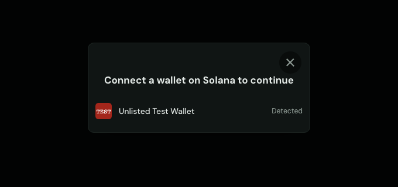
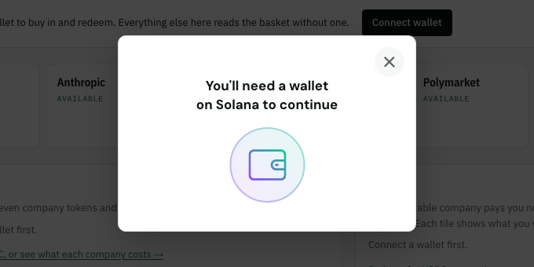

The app at [unlisted-rosy.vercel.app/app](https://unlisted-rosy.vercel.app/app) runs on **devnet only**. Everything on this page is from the deployed app (checked on 2026-09-25) and its code on `main` at `92fe09c`.

**You don't need a wallet to look around.** Without one, every route reads the basket: the seven companies, the values, the events and the issuer's activity. You need one only to buy in, redeem or settle a claim.

## Connecting

There is **one Connect wallet button**, at the top right of every route. The Overview has a second one inside its "Connect a wallet to buy in and redeem" line; both open the same window.

It opens the Solana wallet adapter's modal (`@solana/wallet-adapter-react` 0.15.40 and `@solana/wallet-adapter-react-ui` 0.9.40). The modal lists the **Wallet Standard wallets your browser actually has**, each marked *Detected*. The app bundles no wallet-specific adapters, so a wallet appears only if it's installed and supports Wallet Standard.

With no wallet installed, the modal says **"You'll need a wallet on Solana to continue"** and lists nothing to pick. This is what it showed in a browser with no wallet, on the deployed site:

**Set your wallet to devnet.** The app sends every transaction to devnet and asks the wallet to sign for the `solana:devnet` chain.

## Once connected

- **The button shows your address**, shortened (first four and last four characters), with the wallet's icon.
- **Clicking it opens a small menu:** the wallet's name, then **Copy address**, **Change wallet** (reopens the modal) and **Disconnect**.
- **The connection lasts across routes.** Overview, Buy, Sell, Claims, Basket and History all share it, so moving between them doesn't reconnect.
- **The app reconnects on its own** (`autoConnect`) when you come back, if your wallet allows it.
- If connecting fails, the app shows the wallet's error in a red banner above the page.

## One approval per action

Each action goes to your wallet as **one approval**, even when it takes several transactions. The app passes all of an action's transactions to the wallet in a single signing request, then sends them in order (`web/app/app/_holder/wallet.ts`).

In the recorded runs on the deployed site, a wallet made five approvals for the whole story (`web/e2e/holder/runs/2026-09-25-devnet-overview.json`, the run of 13:29 UTC):

| Action | Transactions | Approvals |
|---|---|---|
| Get test tokens | 2 | 1 |
| Buy in (in kind) | 1 | 1 |
| Redeem (in kind) | 1 | 1 |
| Settle a claim | 1 | 1 |
| Buy with 10 USDC (deposit ticket) | 2 | 1 |

The issuer control on the Overview isn't in that table: it asks your wallet for nothing. The app's server signs it as the devnet fixture issuer ([Dashboard guide](/app/dashboard/#the-issuer-control)).

## Devnet SOL and test tokens

**Devnet SOL, for fees.** Your wallet pays its own transaction fees and the rent for its token accounts, so it needs a little devnet SOL. The app doesn't provide it; it links [faucet.solana.com](https://faucet.solana.com). The Get test tokens button stays disabled while the wallet holds less than 0.02 SOL.

**Test tokens.** When a connected wallet holds **none of the seven** company tokens, the Overview's Buy in box offers **Get test tokens**: 50 fixture USDC and about $20 of each company.

- **How it works:** the app asks its server (`POST /api/faucet`) for two transactions that mint the tokens into your wallet. The server signs them only as the fixture mints' authority; **your wallet is the fee payer**, and pays the rent for the eight token accounts it creates. You approve both transactions at once.
- **One funding per wallet:** the server refuses a wallet that already holds 10 fixture USDC or more ("this wallet already has test tokens").
- **The amounts** are fixed raw amounts, set from the fixture pools' prices on 2026-09-25 (`web/lib/fixtures.json`): 50,000,000 raw fixture USDC (6 decimals), and per company, for example 10,227,963 raw OPENAI and 19,363,694 raw ANTHROPIC (9 decimals). They were about $20 each then; the dollar amount drifts with prices.

**None of these tokens has value.** They're fixture mints on devnet that mirror the real PreStocks mints extension for extension.

## What the app refuses

- **Any cluster but devnet.** The app loads its settings from `/config.json` and refuses a cluster other than devnet (or a local validator), and any RPC address containing "mainnet". The app never talks to mainnet; mainnet prices come from the valuation service, which only reads.
- **Deposits while a company is unavailable.** Buying is refused while any of the seven is paused, frozen or has a transfer hook set. Redeeming still works ([Claims and settlement](/protocol/claims/)).

## What the site can see

- **Your address and balances,** which are public on chain anyway. The app reads your share, company and USDC balances, your open tickets and claims, and asks the valuation service to value your position.
- **Nothing that signs.** The site never holds your key. Every transaction that spends from your wallet is signed in your wallet, after you approve it.
- **The devnet RPC key is visible to your browser.** The app talks to devnet from the browser, so the RPC address it uses, including its key, is public by necessity. It's never committed to the repository (`docs/deploy.md`).

Sources: `web/app/app/_holder/Root.tsx`, `components/ConnectButton.tsx`, `wallet.ts`, `context.tsx`, `config.ts`, `views/Overview.tsx`; `web/app/api/faucet/route.ts`; `web/lib/server/issuer.ts`; `web/lib/fixtures.json`; `web/package.json`; `web/e2e/holder/runs/2026-09-25-devnet-overview.json`; `web/e2e/shots/app-wallet-modal-1440-dark.png`; the deployed app, read on 2026-09-25.

