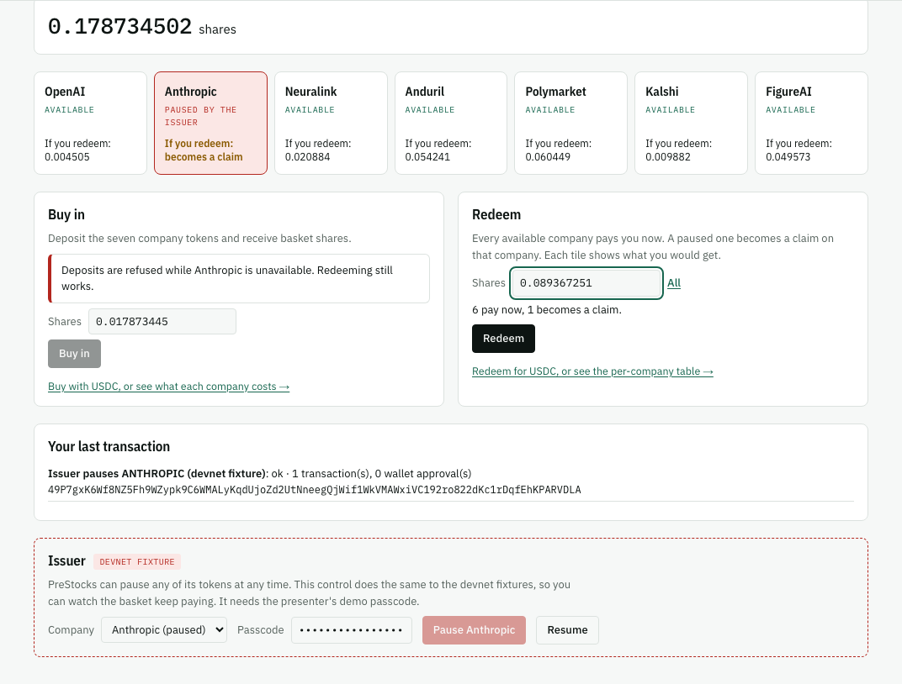
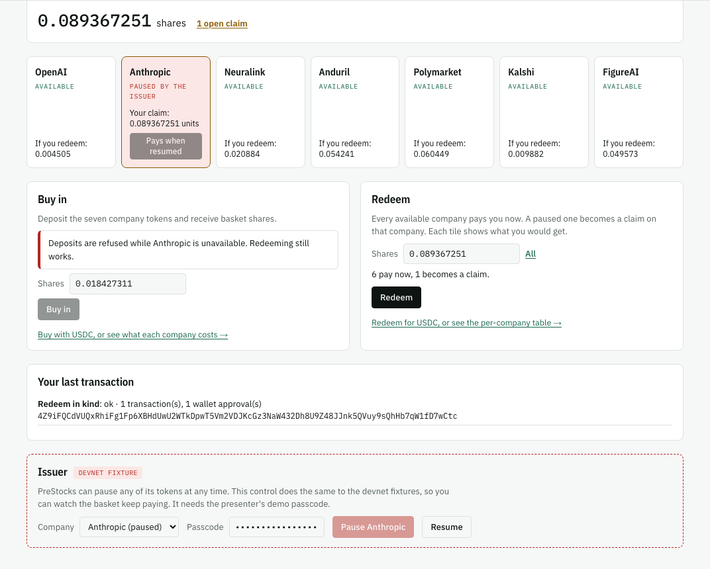
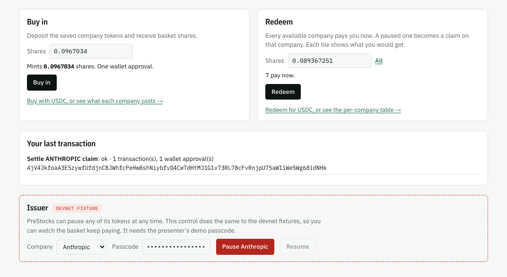
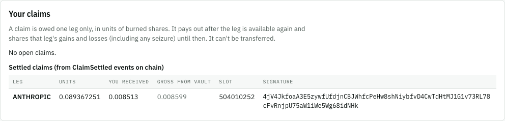

This is the product's thesis in five steps. Everything on this page happened on devnet, in a real browser, on the deployed app at [unlisted-rosy.vercel.app/app](https://unlisted-rosy.vercel.app/app), through the app's own controls on its Overview, from a wallet generated fresh for the run. Every transaction below is finalized.

**The record:** `web/e2e/holder/runs/2026-09-25-devnet-overview.json`, the run that started 2026-09-25 13:29:40 UTC, valued by the hosted valuation service. Wallet `89BxksDMUXm9eswGhNptEgRuH8PoFMWuGuwomciFc8pt`, a Wallet Standard test wallet (not Phantom). What each part of the screen does is on the [Dashboard guide](/app/dashboard/).

**How it was checked.** The test (`web/e2e/holder/flow.spec.ts`) compares what the app rendered from chain data with an independent read: the wallet's token balances from the RPC, the mint's paused flag from the node, and the redemption ticket decoded afterwards. None of its checks read text that also appears in the app's static copy.

## 1. Buy in

The new wallet first takes the app's **test tokens**: 50 fixture USDC and about $20 of each company, in two transactions under one approval ([`5iZ8sduW…1UjyyHaK`](https://explorer.solana.com/tx/5iZ8sduWnGM6NNpCJSnUHX14pBpXnkXcYg8tGvJ3wH9h5R4ehGSWhDvuVyoJU2f2YiBtk69WLsXvErWP1UjyyHaK?cluster=devnet), [`rJsFzUhg…LrAw7eAW`](https://explorer.solana.com/tx/rJsFzUhgC3Uss7mGvrqMhZpYRQx6FA8qM8uz3aSzVEa5a9ynK2hBst3VbM29uiJokqn4V5STTwtD6ynLrAw7eAW?cluster=devnet)).

Then **Buy in** deposits all seven in kind. The app predicts the share amount before signing, and the program mints exactly that: **178,734,502 raw shares** (0.1787 share), one wallet approval.

[`3mRw2PQy…7GphwN9v`](https://explorer.solana.com/tx/3mRw2PQyYn5hsucdMBoxwDztJ1i9UfiCyGZvjgZ5ExsyZqxT28LjoxdG4S95z66naEwvgvGow6kDPtJX7GphwN9v?cluster=devnet "slot 504010078")

## 2. The issuer pauses one company

The fixture issuer pauses ANTHROPIC, through the Overview's passcode-gated issuer control. From now on Token-2022 rejects every ANTHROPIC transfer, including out of the basket's vault. The app sees it by reading the mint: ANTHROPIC's tile turns to *Paused by the issuer*, a banner appears, and Buy in refuses deposits.

[`49P7gxK6…KPARVDLA`](https://explorer.solana.com/tx/49P7gxK6Wf8NZ5Fh9WZypk9C6WMALyKqdUjoZd2UtNneegQjWif1WkVMAWxiVC192ro822dKc1rDqfEhKPARVDLA?cluster=devnet)

In Symmetry, this is where a redemption burns the shares and then pays nothing ([The problem](/product/problem/#what-happens-to-a-basket-when-the-issuer-acts)).

## 3. Redeem anyway: six legs now, a claim on the seventh

The wallet redeems **89,367,251 raw shares** (half its shares) in kind while ANTHROPIC is paused. The redemption goes through:

<table>
<thead><tr><th>Leg</th><th>Outcome (raw amounts, received net of the 1% fee)</th></tr></thead>
<tbody>
<tr class="paid-row"><td>OPENAI</td><td>paid 4,505,224</td></tr>
<tr class="claim-row"><td>ANTHROPIC</td><td>claim of 89,367,251 units, reason <code>Paused</code></td></tr>
<tr class="paid-row"><td>NEURALINK</td><td>paid 20,884,224</td></tr>
<tr class="paid-row"><td>ANDURIL</td><td>paid 54,241,628</td></tr>
<tr class="paid-row"><td>POLYMARKET</td><td>paid 60,449,289</td></tr>
<tr class="paid-row"><td>KALSHI</td><td>paid 9,882,738</td></tr>
<tr class="paid-row"><td>FIGUREAI</td><td>paid 49,573,222</td></tr>
</tbody>
</table>

[`4Z9iFQCd…1fD7wCtc`](https://explorer.solana.com/tx/4Z9iFQCdVUQxRhiFg1Fp6XBHdUwU2WTkDpwT5Vm2VDJKcGz3NaW432Dh8U9Z48JJnk5QVuy9sQhHb7qW1fD7wCtc?cluster=devnet "slot 504010196")

Each company paid exactly what its tile said it would. The claim is still the holder's. It's owed ANTHROPIC only, and it gains and loses with ANTHROPIC, including through any seizure, until it settles.

## 4. The pause lifts

The fixture issuer resumes ANTHROPIC, through the same control.

[`FEKfRtBi…RC3EHnBZ`](https://explorer.solana.com/tx/FEKfRtBiAtrpK2LiyAGxhCphxPPpq76gciUBgbGPUbNXg5xr425J1gzYf1Zf9mydLGVmPdbQgtL2G1PRC3EHnBZ?cluster=devnet)

## 5. The claim pays out

The wallet presses **Settle** on ANTHROPIC's tile. The vault pays **8,599,875 raw** ANTHROPIC gross; after the 1% transfer fee the wallet receives **8,513,876 raw**, exactly the tile's estimate.

[`4jV4Jkfo…g68idNHk`](https://explorer.solana.com/tx/4jV4JkfoaA3E5zywfUfdjnCBJWhfcPeHw8shNiybfvD4CwTdHtMJ1G1v73RL78cFvRnjpU75aW1iWe5Wg68idNHk?cluster=devnet "slot 504010252")

**Settlement is permissionless.** Here the holder settled it from the tile, but anyone can. In the program-level run below, a third party settled the holder's claim.

The same run then went on, with the wallet still connected: a 10 USDC deposit ticket on **Buy** minted 13,786,236 raw shares in two transactions under one approval ([`2nZLrCQr…cnYMcecF`](https://explorer.solana.com/tx/2nZLrCQryR3oaMknhbadeLtF8ssw9zP64PPMNbc8ffJGnfYV1bApaqgAeC1h3oyiLTdLY6F4gTbx44mzcnYMcecF?cluster=devnet), [`4WWxYUjb…h2f3UmBx`](https://explorer.solana.com/tx/4WWxYUjbdHD8xSBAMgBxdzGSwiAD5F76hNxXAnshBjK91wJftYCsKR4tmpngfgQFPMhTG93yKzqHmqmKh2f3UmBx?cluster=devnet "slot 504010623")), and **Basket** showed exactly the valuation service's three values.

## How often it works

- **On the restructured app:** the whole story on the Overview passed **4 of 4 runs against the deployed site**, each first time, each with a new wallet (`web/e2e/holder/runs/repeat-20260925T131651Z.log`: 3 of 3; `repeat-20260925T132939Z.log`: 1 of 1). Each paid six companies now exactly as the tiles said and settled the claim for exactly the tile's estimate. One earlier run, valued by a local copy of the valuation service, also passed.
- **Its broken version failed, as it should.** With the tile deliberately showing the gross amount instead of what you receive, the run stopped at *paid now, exactly as the tile said*: expected 4,554,309, received 4,508,765, the difference being the 1% issuer fee (`web/e2e/BROKEN-VERSIONS.md`, *App stage*).
- **On the app before the restructure,** the same flow passed 5 of 5 against the deployed site on 2026-09-25 (`web/e2e/holder/runs/2026-09-25-devnet.json`, `repeat-20260925T102933Z.log`).

## The same flow, program only

Before the browser, the program itself was driven through the same path on devnet, with more coverage (`tests/program/devnet/pause-mid-redemption.json`):

| Step | Transaction |
|---|---|
| The issuer pauses ANTHROPIC | [`5v24J1Km…mcHBMzsm`](https://explorer.solana.com/tx/5v24J1KmennZW6GQNUj2iWGNLG7TqccwqQTZW7MeLZHro4JuvRfQzRcKNjw2FpQTBTT96qkQCVLCiPGcmcHBMzsm?cluster=devnet "slot 503654748") |
| A holder redeems 0.125 share: six legs paid, ANTHROPIC becomes a claim of 125,000,000 units | [`2jShDvn4…MXd1dQd7`](https://explorer.solana.com/tx/2jShDvn43AK1ReyA8LJF74DDXBgiUfwagPhFRRKy3uQqji7VLFBXEADW5Fhn3rETj7kkQKJLdeKDaf66MXd1dQd7?cluster=devnet "slot 503655019") |
| `settle_claim` while still paused is refused with `LegUnavailable` (simulated, so there is no signature) | — |
| The issuer resumes ANTHROPIC | [`2WYsJ97X…UrPQa3H3`](https://explorer.solana.com/tx/2WYsJ97XLasHnN6VzspzMG8kYZtH6VxKmvjNdSwPZDRAFiSn6wbeAURPR4Sjz7MPvTJcbxKs5EsxRkxUrPQa3H3?cluster=devnet "slot 503655230") |
| A **third party** settles the holder's claim: 123,750,000,000 gross from the vault, 122,512,500,000 received | [`4pois1iL…BKQ29cbs`](https://explorer.solana.com/tx/4pois1iLUcfHM5NQr8uotgMRGyqF6pSBWEnHC4MvcMrNss6BMAh6whjYKwC12zj7KHvaFH5tyZcSHxupBKQ29cbs?cluster=devnet "slot 503655256") |

The same record goes further: two legs paused at once, and a seizure while a claim is open. Those are on [Claims and settlement](/protocol/claims/#a-seizure-while-a-claim-is-open).

Sources: `web/e2e/holder/runs/2026-09-25-devnet-overview.json` (the run of 13:29:40 UTC) and its screenshots, cropped below the page header; `web/e2e/holder/flow.spec.ts`; `web/e2e/holder/runs/repeat-*.log`; `web/e2e/BROKEN-VERSIONS.md`; `web/e2e/holder/runs/2026-09-25-devnet.json`; `tests/program/devnet/pause-mid-redemption.json`.

