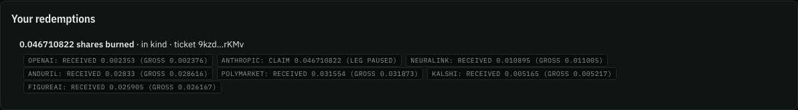
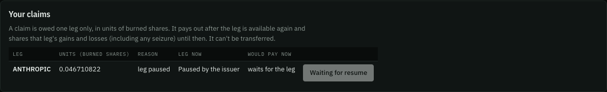
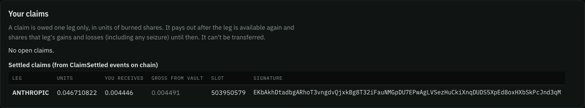

This is the product's thesis in five steps. Everything on this page happened on devnet, in a real browser, from a wallet generated fresh for the run, against the canonical basket and the deployed app. Every transaction below is finalized.

**The record:** `web/e2e/holder/runs/2026-09-25-devnet.json`, the run that started 2026-09-25 10:43:37 UTC. Wallet `FeUo945y3U79Er7FDK25nCta2W6SKhXCfTEqy1irDMCH`, a Wallet Standard test wallet (not Phantom).

**How it was checked.** The test (`web/e2e/holder/flow.spec.ts`) compares what the app rendered from chain data with an independent read: the wallet's token balances from the RPC, the mint's paused flag from the node, and the redemption ticket decoded afterwards. None of its checks read text that also appears in the app's static copy.

## 1. Buy in

The wallet deposits all seven legs in kind. The app predicts the share amount before signing, and the program mints exactly that: **79,622,660 raw shares** (0.0796 share), one wallet approval.

[`2smfMbGR…QwM4QxmB`](https://explorer.solana.com/tx/2smfMbGR9WfU2D2aFd9EyvhbzRtyBpPM9sT8rGoBdqHLYUG8BKNHEvzmt1HJnb8Nc9VPV6fEF5nrQkwRQwM4QxmB?cluster=devnet "slot 503950052")

It then deposits 10 USDC through a deposit ticket (two transactions, one approval), which mints **13,798,984 raw shares** more: [`4jMWFK8f…R89KwSvq`](https://explorer.solana.com/tx/4jMWFK8fA6ePKr5BCasCdsHePJ4K3wQaHK5kYHSU9vLbb4nET47oWVdbv6CL6ncVkVoxW7Dacmciju7HR89KwSvq?cluster=devnet), [`wkkqRHLk…fctSb8oS`](https://explorer.solana.com/tx/wkkqRHLkFSMdcd1a82WxRn3fmGkZ4T7idq8QAJMEjm3oEUQ4yAkYXV49PGGbc6tKKikgf5GDacrhnRBfctSb8oS?cluster=devnet "slot 503950237").

## 2. The issuer pauses one company

The fixture issuer pauses ANTHROPIC. From now on Token-2022 rejects every ANTHROPIC transfer, including out of the basket's vault.

[`34vdB7ut…TjSs1XRf`](https://explorer.solana.com/tx/34vdB7ut22mKXrTHJXBwtf3LC8VMvkpZfVsnoPUp2QuZ6WqzN2UN5683fiCVfVFGd6brQSoZYHRobeJrTjSs1XRf?cluster=devnet)

In Symmetry, this is where a redemption burns the shares and then pays nothing ([The problem](/product/problem/#what-happens-to-a-basket-when-the-issuer-acts)).

## 3. Redeem anyway: six legs now, a claim on the seventh

The wallet redeems **46,710,822 raw shares** in kind while ANTHROPIC is paused. The redemption goes through:

<table>
<thead><tr><th>Leg</th><th>Outcome (raw amounts, received net of the 1% fee)</th></tr></thead>
<tbody>
<tr class="paid-row"><td>OPENAI</td><td>paid 2,353,035</td></tr>
<tr class="claim-row"><td>ANTHROPIC</td><td>claim of 46,710,822 units, reason <code>Paused</code></td></tr>
<tr class="paid-row"><td>NEURALINK</td><td>paid 10,895,200</td></tr>
<tr class="paid-row"><td>ANDURIL</td><td>paid 28,330,254</td></tr>
<tr class="paid-row"><td>POLYMARKET</td><td>paid 31,554,931</td></tr>
<tr class="paid-row"><td>KALSHI</td><td>paid 5,165,547</td></tr>
<tr class="paid-row"><td>FIGUREAI</td><td>paid 25,905,601</td></tr>
</tbody>
</table>

[`3aYQyrBP…4Xcik9tz`](https://explorer.solana.com/tx/3aYQyrBPgsFJYk1Vt67LPLG214SPgxoBKMTBbvxKYzGfmDTz4PfYWJrcinS4psQ1YvTXWzsUR6AstjJt4Xcik9tz?cluster=devnet "slot 503950452")

The claim is still the holder's. It's owed ANTHROPIC only, and it gains and loses with ANTHROPIC, including through any seizure, until it settles.

## 4. The pause lifts

The fixture issuer resumes ANTHROPIC.

[`3edK8hFC…v59oS1fe`](https://explorer.solana.com/tx/3edK8hFCjpkCx99GKW53u4zQFJtCVVerwbF2VrzEcps5uaVcpXmcA1XW11qH3T4vuMbM9aQUxrupGNBNv59oS1fe?cluster=devnet)

## 5. The claim pays out

The app settles the claim. The vault pays **4,491,235 raw** ANTHROPIC gross; after the 1% transfer fee the wallet receives **4,446,322 raw**, exactly the app's estimate.

[`EKbAkhDt…PcJnd3qM`](https://explorer.solana.com/tx/EKbAkhDtadbgARhoT3vngdvQjxkBg8T32iFauNMGpDU7EPwAgLVSezHuCkiXnqDUDS5XpEd8oxHXbSkPcJnd3qM?cluster=devnet "slot 503950579")

**Settlement is permissionless.** Here the holder's own app settled it, but anyone can. In the program-level run below, a third party settled the holder's claim.

## How often it works

The same flow ran **5 times in a row against the deployed site, and passed 5 of 5 first time** (110–167 s each), each with a new wallet, each paying six legs now and settling the ANTHROPIC claim for exactly the app's estimate (`web/e2e/holder/runs/repeat-20260925T102933Z.log`, and the commit that recorded it). Two single runs afterwards also passed. Earlier that day, two runs failed: the pause banner didn't appear within 5 seconds in one, and a transaction's blockhash expired in the other. Both failures are kept in the same record, next to a deliberately broken run that failed as intended.

**The screenshots above are from the app as it was when the run was recorded.** The app has since been restructured; the step-by-step guide to the current app will follow on its own page.

## The same flow, program only

Before the browser, the program itself was driven through the same path on devnet, with more coverage (`tests/program/devnet/pause-mid-redemption.json`):

| Step | Transaction |
|---|---|
| The issuer pauses ANTHROPIC | [`5v24J1Km…mcHBMzsm`](https://explorer.solana.com/tx/5v24J1KmennZW6GQNUj2iWGNLG7TqccwqQTZW7MeLZHro4JuvRfQzRcKNjw2FpQTBTT96qkQCVLCiPGcmcHBMzsm?cluster=devnet "slot 503654748") |
| A holder redeems 0.125 share: six legs paid, ANTHROPIC becomes a claim of 125,000,000 units | [`2jShDvn4…MXd1dQd7`](https://explorer.solana.com/tx/2jShDvn43AK1ReyA8LJF74DDXBgiUfwagPhFRRKy3uQqji7VLFBXEADW5Fhn3rETj7kkQKJLdeKDaf66MXd1dQd7?cluster=devnet "slot 503655019") |
| `settle_claim` while still paused is refused with `LegUnavailable` (simulated, so there is no signature) | — |
| The issuer resumes ANTHROPIC | [`2WYsJ97X…UrPQa3H3`](https://explorer.solana.com/tx/2WYsJ97XLasHnN6VzspzMG8kYZtH6VxKmvjNdSwPZDRAFiSn6wbeAURPR4Sjz7MPvTJcbxKs5EsxRkxUrPQa3H3?cluster=devnet "slot 503655230") |
| A **third party** settles the holder's claim: 123,750,000,000 gross from the vault, 122,512,500,000 received | [`4pois1iL…BKQ29cbs`](https://explorer.solana.com/tx/4pois1iLUcfHM5NQr8uotgMRGyqF6pSBWEnHC4MvcMrNss6BMAh6whjYKwC12zj7KHvaFH5tyZcSHxupBKQ29cbs?cluster=devnet "slot 503655256") |

The same record goes further: two legs paused at once, and a seizure while a claim is open. Those are on [Claims and settlement](/protocol/claims/#a-seizure-while-a-claim-is-open).

Sources: `web/e2e/holder/runs/2026-09-25-devnet.json` and the three screenshots copied from it; `web/e2e/holder/flow.spec.ts`; `web/e2e/holder/runs/repeat-*.log`; commit `849f1b4`; `tests/program/devnet/pause-mid-redemption.json`.

